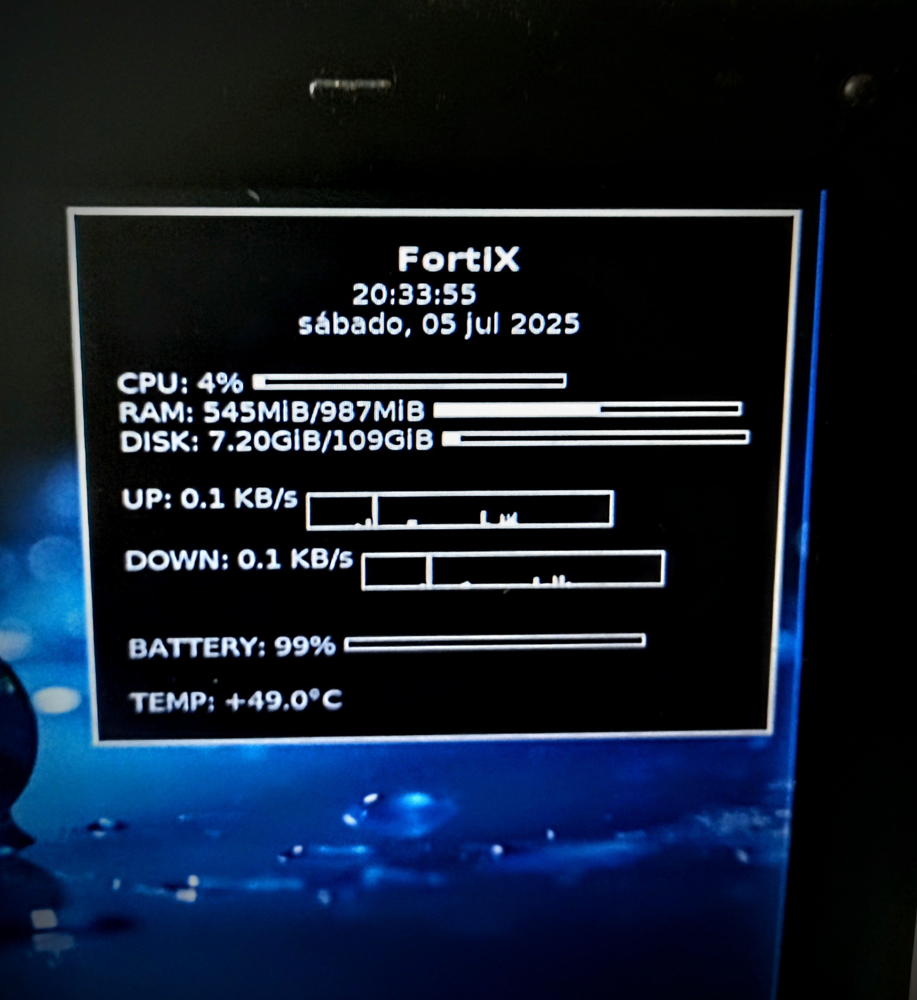

<div align="center">
  
  <h1>🛡️ FortiX-Conky</h1>
  <p>Monitor de sistema minimalista para <strong>FortiX OS</strong> — ligero, funcional y elegante.</p>
</div>

---

## 📌 Descripción

**FortiX-Conky** es la configuración oficial de **Conky** para la distro **FortiX OS**.  
Muestra información clave del sistema (CPU, RAM, disco, red, batería, temperatura) de forma clara y amigable, con estética acorde a los fondos de pantalla FortiX.

---

## 🖥️ Vista previa

> 

---

## ⚙️ Requisitos

- **Conky** instalado:
  ```bash
  sudo apt install conky-all
